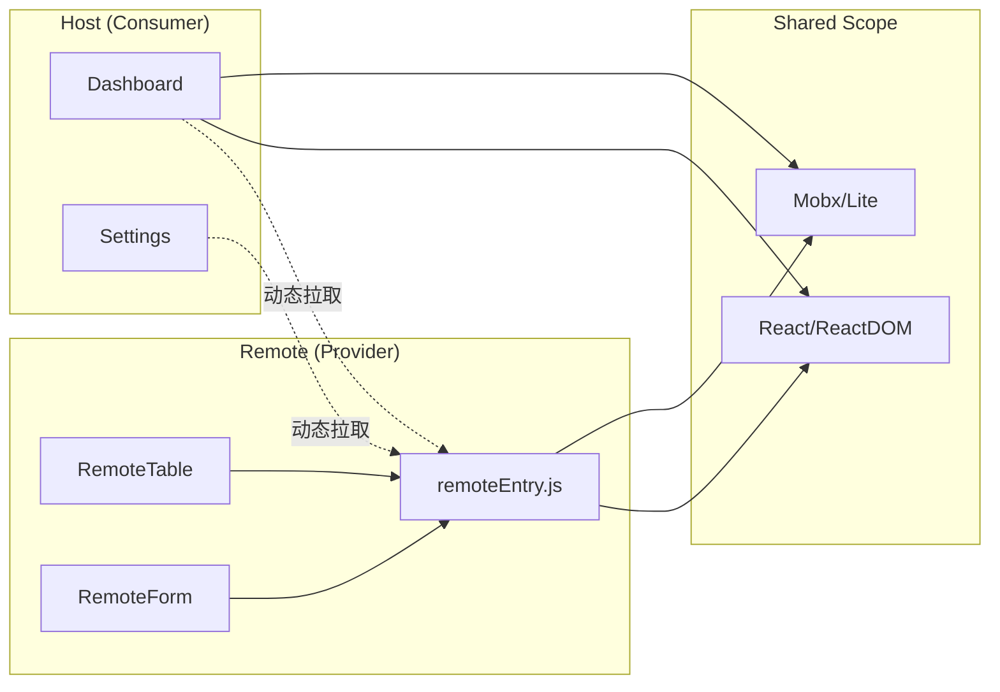

# 前端远程组件方案设计 (RemoteComponent)

> 基于 Webpack 5 Module Federation 的微模块架构，实现组件级的运行时加载与独立部署。

## 目录
- [1. 目标 (Goals)](#1-目标-goals)
- [2. 方案对比 (Solution Comparison)](#2-方案对比-solution-comparison)
- [3. 技术选型 (Tech Stack)](#3-技术选型-tech-stack)
- [4. 核心架构 (Core Architecture)](#4-核心架构-core-architecture)
  - [4.1 架构模型](#41-架构模型)
  - [4.2 样式隔离策略](#42-样式隔离策略-styling)
- [5. 目录结构 (Directory Structure)](#5-目录结构-directory-structure)
- [6. 关键实现 (Implementation)](#6-关键实现-implementation)
  - [6.1 Remote 端配置](#61-remote-端配置-webpackconfigjs)
  - [6.2 Host 端配置](#62-host-端配置-webpackconfigjs)
  - [6.3 Host 端消费](#63-host-端消费)
  - [6.4 运行时动态加载远程容器](#64-运行时动态加载远程容器-runtime-dynamic-loading)
- [7. 核心机制深入 (Deep Dive)](#7-核心机制深入-deep-dive)
  - [7.1 ModuleFederationPlugin 核心配置详解](#71-modulefederationplugin-核心配置详解)
  - [7.2 核心概念](#72-核心概念)
  - [7.3 加载流程](#73-加载流程以-remotecomponent-为例)
  - [7.4 依赖共享机制深入](#74-依赖共享机制shared-scope-深入)
  - [7.5 适用场景与限制](#75-适用场景与限制)
- [8. 构建与部署流程 (Build & Deploy)](#8-构建与部署流程-build--deploy)
  - [8.1 配置阶段](#81-配置阶段)
  - [8.2 Remote 端打包流程](#82-remote-端打包流程)
  - [8.3 容器对象实例](#83-容器对象实例-window-container-object)
  - [8.4 Shared 依赖处理](#84-shared-依赖处理)
  - [8.5 产物输出](#85-产物输出)
  - [8.6 打包产物示例](#86-打包产物示例-artifacts-demo)
  - [8.7 Host 端打包流程](#87-host-端打包流程)
  - [8.8 开发环境 vs 生产环境](#88-开发环境-vs-生产环境)
  - [8.9 发布与更新策略](#89-发布与更新策略)
- [9. 隔离与安全 (Isolation)](#9-隔离与安全-isolation)
  - [9.1 JS 隔离](#91-js-隔离)
  - [9.2 CSS 隔离](#92-css-隔离)
- [10. 最佳实践与优化 (Best Practices)](#10-最佳实践与优化-best-practices)
  - [10.1 异常处理与降级](#101-异常处理与降级-fallback)
  - [10.2 性能优化](#102-性能优化)
  - [10.3 调试技巧](#103-调试技巧)
- [11. 潜在挑战与局限性 (Challenges & Limitations)](#11-潜在挑战与局限性-challenges--limitations)

---

## 1. 目标 (Goals)
实现一个高效、可扩展的远程组件架构，支持：
- **运行时加载**: 宿主应用在运行时从 CDN 加载组件，无需构建时静态导入。
- **独立部署**: 远程组件项目更新后，宿主应用无需重新打包即可生效，解耦开发周期。
- **动态依赖共享**: 自动处理 React、Mobx 等公共依赖，避免重复加载，保证单例运行。

---

## 2. 方案对比 (Solution Comparison)

为说明本方案（Webpack 5 Module Federation）选择的合理性，这里对常见几类“远程组件/远程模块”方案进行对比。

### 2.1 典型方案概览

| 方案 | 加载方式 | 依赖共享 | 隔离性 | 发布/回滚成本 | 典型适用场景 |
| --- | --- | --- | --- | --- | --- |
| **NPM 组件库** | 构建时安装、打包 | 无（各自打包进 Host） | 高（按模块边界） | 高（每次都要重新发版 + 重建 Host） | 设计系统、稳定基础组件 |
| **CDN UMD 组件 + `window.xxx`** | 运行时 `<script>` 注入 | 手动处理（通常重复加载） | 低（易污染全局） | 中（可替换 CDN 版本，但接口变更难管控） | 老项目、简单挂业务插件 |
| **iframe 微前端** | 运行时 `<iframe>` | 实际无共享（强隔离） | 很高（JS/CSS 全隔离） | 中（独立发布，但集成体验差） | 完整子系统嵌入、不同技术栈共存 |
| **应用级微前端 (qiankun)** | 运行时加载整个应用 | 依赖共享有限/需自研 | 中（约定式隔离） | 中（子应用独立发布） | 多路由/多页面级别拆分 |
| **自研 Runtime Loader** | 运行时按 URL 加载模块 | 可手动实现，但复杂 | 取决于实现 | 中高（协议稳定性要自控） | 需支持多构建工具、多语言模块 |
| **Module Federation (本方案)** | 运行时按模块名加载 | 内置 shared 机制 | 中高（模块边界清晰） | 低（Remote 独立发布） | “组件级”远程加载，React 业务拆分 |

### 2.2 核心差异分析

1. **与 NPM 组件库的对比**：NPM 方案是**构建时绑定**，无法做到真正的运行时热更新；而 MF 支持 Remote 独立部署，Host 无需重建即可生效。
2. **与 iframe / 应用级微前端的对比**：iframe 适合整应用隔离，但对“单个组件”级别的复用非常笨重；MF 就像 `import` 本地组件一样自然。
3. **与 CDN UMD / 自研 Loader 的对比**：MF 将“容器管理、版本协商、依赖单例化”框架化为 Webpack 特性，相比自研方案大幅降低了工程落地成本。

### 2.3 本方案定位

综合来看，本方案主要针对 **组件级 / 业务模块级** 的远程加载，旨在平衡“业务复杂度、迭代效率、工程成本”。

---

## 3. 技术选型 (Tech Stack)
- **构建工具**: Webpack 5
- **核心插件**: `ModuleFederationPlugin`
- **状态管理**: Mobx 6+ (支持跨容器状态共享)
- **UI 框架**: React 18
- **样式方案**: CSS Modules + Tailwind CSS

## 4. 核心架构 (Core Architecture)

### 4.1 架构模型
采用 **Provider-Consumer (提供者-消费者)** 模型：



- **Remote (Provider)**: `apps/RemoteComponent`
  - 负责定义、打包并导出原子化或业务级组件。
  - 生成 `remoteEntry.js` 作为动态加载的清单文件。
- **Host (Consumer)**: 其他业务项目 (如 `apps/admin`)
  - 配置远程节点，通过异步方式消费远程组件。

### 4.2 样式隔离策略 (Styling)
- **CSS Modules (推荐)**: 默认方案。通过类名 Hash 确保样式仅在组件内生效。
- **Tailwind Prefix**: 若使用 Tailwind，必须配置全局前缀 (如 `rc-`) 以防覆盖宿主样式。
- **Shadow DOM (可选)**: 针对极其复杂的样式隔离需求，可考虑将远程组件挂载在 Shadow Root 下。

## 5. 目录结构 (Directory Structure)
```text
apps/RemoteComponent/
├── src/
│   ├── components/         # 远程暴露的组件集合
│   │   ├── RemoteTable/    # 业务组件示例
│   │   └── index.ts        # 统一导出入口
│   ├── bootstrap.tsx       # 异步启动逻辑
│   ├── App.tsx             # 本地开发预览环境
│   └── index.tsx           # Webpack 入口
├── webpack.config.js       # MF 提供方核心配置
└── tailwind.config.js      # 样式前缀配置
```

## 6. 关键实现 (Implementation)

### 6.1 Remote 端配置 (webpack.config.js)
```javascript
const { ModuleFederationPlugin } = require('webpack').container;

module.exports = {
  // ... 其他配置
  plugins: [
    new ModuleFederationPlugin({
      name: 'remote_app',
      filename: 'remoteEntry.js',
      exposes: {
        './RemoteTable': './src/components/RemoteTable/index.tsx',
      },
      shared: {
        react: { singleton: true, requiredVersion: '^18.0.0' },
        'react-dom': { singleton: true, requiredVersion: '^18.0.0' },
        mobx: { singleton: true }
      },
    }),
  ],
};
```

### 6.2 Host 端配置 (webpack.config.js)
```javascript
const { ModuleFederationPlugin } = require('webpack').container;

module.exports = {
  // ... 其他配置
  plugins: [
    new ModuleFederationPlugin({
      name: 'host_app',
      remotes: {
        // 声明远程容器的名称及入口地址
        remote_app: 'remote_app@http://localhost:3001/remoteEntry.js',
      },
      shared: {
        react: { singleton: true, requiredVersion: '^18.0.0' },
        'react-dom': { singleton: true, requiredVersion: '^18.0.0' },
        mobx: { singleton: true }
      },
    }),
  ],
};
```

### 6.3 Host 端消费
```tsx
import React, { Suspense } from 'react';
import ErrorBoundary from './components/ErrorBoundary';

// 静态导入：依赖 webpack 配置中的 remotes
const RemoteTable = React.lazy(() => import('remote_app/RemoteTable'));

const App = () => (
  <ErrorBoundary fallback={<p>组件加载失败</p>}>
    <Suspense fallback={<div>Loading Remote Component...</div>}>
      <RemoteTable title="远程数据表" />
    </Suspense>
  </ErrorBoundary>
);
```

### 6.4 运行时动态加载远程容器 (Runtime Dynamic Loading)

在某些场景下（如环境 URL 动态化、A/B 测试或基于插件系统的应用），我们无法在构建时硬编码远程地址。此时可以利用 Webpack 的运行时 API 动态加载：

#### 6.4.1 实现工具函数
```typescript
/**
 * 动态加载远程组件脚本并初始化容器
 * @param url remoteEntry.js 的完整地址
 * @param scope 远程应用的 name (对应 MF 配置中的 name)
 * @param module 导出的路径 (如 './RemoteTable')
 */
async function loadRemoteModule(url: string, scope: string, module: string) {
  // 1. 动态注入 script 标签
  await new Promise((resolve, reject) => {
    const script = document.createElement('script');
    script.src = url;
    script.type = 'text/javascript';
    script.async = true;
    script.onload = resolve;
    script.onerror = reject;
    document.head.appendChild(script);
  });

  // 2. 初始化共享作用域 (Share Scope)
  await __webpack_init_sharing__('default');

  // 3. 获取远程容器
  const container = window[scope];
  
  // 4. 初始化容器
  await container.init(__webpack_share_scopes__.default);

  // 5. 获取模块工厂并执行
  const factory = await container.get(module);
  const Module = factory();
  return Module;
}
```

#### 6.4.2 业务中使用
```tsx
const DynamicRemoteTable = React.lazy(() => 
  loadRemoteModule(
    'http://cdn.example.com/remoteEntry.js', 
    'remote_app', 
    './RemoteTable'
  )
);
```

## 7. 核心机制深入 (Deep Dive)

### 7.1 ModuleFederationPlugin 核心配置详解
`ModuleFederationPlugin` 是实现模块联邦的核心配置工具。以下是其关键参数的详细介绍：

| 配置项 | 类型 | 作用描述 | 关键注意点 |
| :--- | :--- | :--- | :--- |
| **name** | `string` | 定义当前容器的全局唯一名称。 | 必填。会作为全局变量挂载到 `window` 上，Host 端通过此名称引用。 |
| **filename** | `string` | 生成的远程入口清单文件名。 | 通常设为 `remoteEntry.js`。Host 应用在运行时首先加载此文件以获取模块元数据。 |
| **remotes** | `object` | 声明当前应用需要消费的远程应用。 | 键为本地引用别名，值为远程容器名和地址（如 `app: 'app@http://.../remoteEntry.js'`）。 |
| **exposes** | `object` | 导出当前应用的内部模块供他人使用。 | 键为对外暴露的路径，值为内部模块的实际相对路径。 |
| **shared** | `object` | 定义多个应用间共享的公共依赖库。 | 包含 `singleton`（单例）、`requiredVersion`（版本要求）等高级配置，防止 React 等库出现多实例。 |

### 7.2 核心概念

模块联邦（Module Federation）是 Webpack 5 提供的一种 **跨构建共享模块** 的机制，核心目标是：

- 不同项目（构建产物）之间可以像本地模块一样互相 `import`
- 每个项目仍能独立构建、独立部署
- 自动处理依赖共享与版本协商，避免重复打包 React 等公共库

几个关键角色：

- **Host（消费方）**：使用远程模块的应用，如 `apps/admin`
- **Remote（提供方）**：暴露模块给其他应用使用，如 `apps/RemoteComponent`
- **Container Runtime（容器运行时）**：Webpack 在浏览器中注入的运行时代码，用于：
  - 注册和查找远程模块
  - 拉取 `remoteEntry.js`
  - 处理 shared 依赖的版本与实例复用

### 7.3 加载流程（以 RemoteComponent 为例）

以 Host 端 `import('remote_app/RemoteTable')` 为例，其内部大致流程：

1. **构建阶段**
   - Remote 端通过 `ModuleFederationPlugin` 配置：
     - `name: 'remote_app'`
     - `exposes: { './RemoteTable': './src/components/RemoteTable/index.tsx' }`
   - Webpack 根据该配置生成：
     - `remoteEntry.js`：一份模块暴露清单 + 加载入口
     - 对应的业务 chunk：真正的组件代码

2. **运行时注册**
   - Remote 应用加载时，`remoteEntry.js` 被浏览器执行：
     - 调用 Webpack runtime，将 `remote_app` 注册为一个 **远程容器**
     - 同时注册它暴露出来的模块映射关系（如 `'./RemoteTable' -> 具体 chunk`）

3. **Host 端发起远程加载**
   - 当 Host 代码执行到：`import('remote_app/RemoteTable')` 时：
     1. Webpack runtime 检查是否已加载 `remote_app` 容器
     2. 如未加载，则动态插入 `<script src="remoteEntry.js">` 拉取容器
     3. 等待 `remoteEntry.js` 执行完成，拿到远程容器对象
     4. 请求容器中的 `'./RemoteTable'` 模块工厂函数
     5. 若该模块还依赖其它 chunk（按需加载），继续动态加载对应 JS 文件

4. **模块执行与使用**
   - 得到模块工厂函数后，Webpack runtime 会：
     - 先完成 shared 依赖初始化（见 6.3）
     - 执行模块工厂函数，得到真正的 React 组件
   - 在代码层面，Host 侧就像拿到了一个本地的 `RemoteTable` 组件一样使用。

#### 7.3.1 加载流程伪代码
```js
> 伪代码仅描述关键流程，与实际 Webpack 运行时代码略有差异，用于帮助理解 Host 从 0 到拿到远程组件的完整加载阶段。

// ======================
// Host 侧：业务触发入口
// ======================
function renderHostPage() {
  // React.lazy 触发异步加载远程组件
  const RemoteTable = React.lazy(() =>
    // 实际上会走到下面的 loadRemoteModule 流程
    loadRemoteModule({
      remoteName: 'remote_app',
      exposedModule: './RemoteTable',
    })
  );

  return (
    <ErrorBoundary>
      <Suspense fallback={<Spinner />}>
        <RemoteTable title="远程数据表" />
      </Suspense>
    </ErrorBoundary>
  );
}

// ===========================================
// 抽象的“加载远程模块”伪代码（Host 运行时角度）
// ===========================================
async function loadRemoteModule(options: {
  remoteName: string;     // 容器名，如 'remote_app'
  exposedModule: string;  // 模块路径，如 './RemoteTable'
}) {
  const { remoteName, exposedModule } = options;

  // 1. 确保 remoteEntry 已经加载（容器已注册）
  // ----------------------------------------------------------------
  //  1.1 从 Host 的 MF 配置中拿到 remote 的 URL
  const remoteUrl = getRemoteEntryUrlFromConfig(remoteName);
  //  1.2 如果容器还不存在，则动态插入 <script> 加载 remoteEntry.js
  if (!window[remoteName]) {
    await loadRemoteEntryScript(remoteUrl);  // 等价于动态创建 <script> 标签并等待 onload
  }

  // 2. 初始化 shared 作用域（全局只需做一次，但伪代码里简化为每次确保完成） 
  // ----------------------------------------------------------------
  //  调用 Webpack runtime 的共享初始化逻辑
  await __webpack_init_sharing__('default'); // 初始化默认 shared scope

  // 3. 获取远程容器并完成协商
  // ----------------------------------------------------------------
  const container = window[remoteName];      // e.g. window.remote_app

  //  3.1 将 Host 的 shared scope 传给 Remote，完成版本协商
  //      - Remote 会把自己声明的 shared 依赖注入进来
  //      - Host / Remote 共同决定实际使用哪个版本（如 React 单例）
  await container.init(__webpack_share_scopes__.default);

  // 4. 从容器里获取远程模块
  // ----------------------------------------------------------------
  //  4.1 container.get 返回一个 Promise，resolve 为模块工厂函数
  const moduleFactory = await container.get(exposedModule); // e.g. './RemoteTable'

  //  4.2 执行工厂函数，得到真正的模块导出对象
  const moduleExports = moduleFactory();

  //  4.3 按需返回默认导出或具名导出
  return moduleExports.default || moduleExports;
}

// ======================
// 工具：加载 remoteEntry.js
// ======================
function loadRemoteEntryScript(url: string): Promise<void> {
  return new Promise((resolve, reject) => {
    const existingScript = document.querySelector<HTMLScriptElement>(
      `script[data-remote-entry="${url}"]`
    );
    if (existingScript) {
      // 已经在加载或加载完成，直接复用
      existingScript.addEventListener('load', () => resolve());
      existingScript.addEventListener('error', () =>
        reject(new Error('remoteEntry load error'))
      );
      return;
    }

    const script = document.createElement('script');
    script.src = url;
    script.type = 'text/javascript';
    script.async = true;
    script.dataset.remoteEntry = url;

    script.onload = () => resolve();
    script.onerror = () =>
      reject(new Error(`Failed to load remoteEntry: ${url}`));

    document.head.appendChild(script);
  });
}
```

### 7.4 依赖共享机制（Shared Scope）深入

`ModuleFederationPlugin` 通过一套复杂的 **共享作用域 (Share Scope)** 机制来管理跨应用的依赖：

#### 7.4.1 构建阶段：元数据生成
在 Webpack 构建时，插件会根据 `shared` 配置生成特殊的模块：
- **ProvideSharedModule**: 如果应用是共享库的提供者，Webpack 会将该库标记，并准备好供他人使用的元数据。
- **ConsumeSharedModule**: 如果应用是消费者，Webpack 会生成一段异步加载逻辑，优先从全局共享作用域查找。
- **版本清单**: 插件会记录每个共享库的 `version` 和 `eager` 属性，并将这些元数据写入 `remoteEntry.js`。

#### 7.4.2 运行阶段：初始化与协商 (init)
这是共享依赖生效的关键步骤：
1. **Scope 注册**: 当 Host 加载 Remote 时，首先调用 Remote 容器的 `init(shareScope)` 方法。
2. **合并作用域**: Remote 会将自己的共享依赖清单合并到全局 `shareScope` 对象中（通常是 `default` 作用域）。
3. **版本协商 (Resolution)**:
   - Webpack 运行时会检查 `shareScope` 中所有可用的版本。
   - **最高版本优先**: 如果没有特殊限制，选择版本号最高的实例。
   - **语义版本匹配**: 根据 `requiredVersion` (如 `^18.0.0`) 过滤。
4. **加载模块**: 一旦确定了版本，Host 和 Remote 都会通过 `get()` 方法从共享作用域获取对应的模块工厂函数。

#### 7.4.3 单例模式 (Singleton) 逻辑
当配置了 `singleton: true` 时：
- Webpack 保证在整个应用生命周期中，某个库（如 React）**只会被初始化一次**。
- 如果 Host 已经加载了 React，Remote 即使版本略高也会被迫使用 Host 的实例（除非版本冲突严重导致 `strictVersion` 报错）。
- 这解决了 React Hook 必须依赖同一个单例 `dispatcher` 的核心问题。

#### 7.4.4 最终效果
- Host 与多个 Remote 应用共享同一份 React/Mobx 实例：
  - 避免包体积膨胀。
  - 保证状态管理库（如 Mobx）在不同应用间行为一致。
  - 避免 React 多实例导致的 Context/Mobx Provider 失效等问题。

### 7.5 适用场景与限制

**适用场景**

- 多团队、多仓库协作的前端架构（微前端）
- 远程组件库/业务模块的独立发布与灰度
- 希望在不重建 Host 的前提下，快速更新某些业务模块

**注意点 / 限制**

- Host 和 Remote 在运行时必须能访问彼此的构建产物（一般通过 CDN）
- 构建工具需统一使用 Webpack 5，或保证 Module Federation 兼容
- shared 依赖版本要尽量收敛，避免多版本共存导致行为不一致
- 运行时加载意味着首屏可能增加一次 HTTP 请求，需要结合缓存与预加载优化

---

## 8. 构建与部署流程 (Build & Deploy)

下面以本方案中的 Remote (`apps/RemoteComponent`) 与 Host（如 `apps/admin`）为例，说明从配置到产物输出的整体打包流程。

### 8.1 配置阶段

1. **Remote 侧配置 `ModuleFederationPlugin`**
   - 关键字段：
     - `name`: 远程容器名称（如 `remote_app`）
     - `filename`: 容器入口文件名（如 `remoteEntry.js`）
     - `exposes`: 暴露的模块映射（如 `'./RemoteTable' -> './src/components/RemoteTable/index.tsx'`）
     - `shared`: 共享依赖（`react` / `react-dom` / `mobx` 等）

2. **Host 侧配置 `ModuleFederationPlugin`**
   - 关键字段：
     - `remotes`: 声明远程容器及其地址
       - 例如：`remote_app: 'remote_app@https://cdn.xxx.com/remoteEntry.js'`
     - `shared`: 与 Remote 尽量保持一致的共享依赖配置

3. **Webpack 解析与依赖图构建**
   - Webpack 在构建时会：
     - 扫描入口和所有依赖模块，构建依赖图（包括 `import('remote_app/RemoteTable')` 等动态导入语句）。
     - 根据 `ModuleFederationPlugin` 的配置，标记哪些模块属于：
       - 本地 chunk
       - 暴露给外部的 remote 模块
       - 需要加入 shared 作用域的依赖

---

### 8.2 Remote 端打包流程

以 `apps/RemoteComponent` 为例，一个典型的构建过程大致如下：

1. **入口解析**
   - 常规 Webpack 入口（如 `src/App.tsx`）用于本地预览开发。
   - 同时，`ModuleFederationPlugin` 会在内部注入一个“容器入口”，用于生成 `remoteEntry.js`。

2. **业务代码分块（chunk）**
   - Webpack 根据 import 关系进行代码分割：
     - 主业务 chunk（如远程组件相关代码）
     - 公共依赖 chunk（如 lodash 等未被 shared 的库）
     - 运行时代码（Webpack runtime）

3. **生成 Remote 容器 (`remoteEntry.js`)**
   - `ModuleFederationPlugin` 生成一个特殊的入口文件 `remoteEntry.js`，其主要职责是：
     - 在浏览器中注册一个名为 `remote_app` 的容器对象。
     - 声明容器中可被远程访问的模块清单：
       - 例如 `'./RemoteTable' -> 对应的业务 chunk id/文件名`。
     - 初始化 shared 作用域的提供方/消费方逻辑（如如何提供 `react`、如何从 Host 复用 `react`）。

### 8.3 容器对象实例 (Window Container Object)
- 当 `remoteEntry.js` 加载完成后，会在全局 `window` 上注册对应的容器对象（如 `window.remote_app`）。该对象符合模块联邦协议，其结构如下：

// 浏览器控制台打印 window.remote_app 的示意
{
  /**
   * get 方法：用于异步获取容器中暴露的模块工厂函数
   * @param {string} module - 模块路径，如 "./RemoteTable"
   * @returns {Promise<Function>} 返回一个 Promise，resolve 后得到模块工厂
   */
  get: async (module) => {
    // 内部逻辑：根据 moduleMap 查找并加载对应的 chunk
    // 返回一个 factory 函数，执行 factory() 即可得到导出的组件
  },

  /**
   * init 方法：用于初始化容器，并与其共享作用域进行协商
   * @param {Object} shareScope - 宿主应用传来的共享作用域对象
   */
  init: (shareScope) => {
    // 内部逻辑：
    // 1. 将当前容器的 shared 依赖版本信息存入 shareScope
    // 2. 根据 singleton 等规则确定使用本地版本还是宿主提供的版本
  }
}
### 8.4 Shared 依赖处理
   - 对 `shared` 声明的依赖（如 `react`）：
     - Remote 不会把其完整代码再次打包进自身业务 chunk 中。
     - 而是生成一些“共享初始化”代码，用来：
       - 在需要时向 shared scope 注册本地版本（当 Remote 首先被加载时）。
       - 或者从已有 shared scope 中获取单例（当 Host 先于 Remote 被加载时）。

### 8.5 产物输出
   - Remote 构建产物通常包括：
     - `remoteEntry.js`：远程容器入口 + 模块清单。
     - 若干业务 chunk：如 `RemoteTable` 组件相关 bundle。
     - 样式文件：如 `remote.[contenthash].css`（含 CSS Modules/Tailwind）。
     - 静态资源：带 hash 的图片、字体等。

### 8.6 打包产物示例 (Artifacts Demo)

为了更直观地理解构建结果，以下是执行 `npm run build` 后 `dist` 目录中关键文件的结构及内容示意：

#### 8.6.1 目录结构示意
dist/
├── remoteEntry.js          # 远程入口清单（核心元数据）
├── src_components_RemoteTable_index_tsx.js # 业务组件代码块 (Chunk)
├── 789.js                   # 共享依赖或公共逻辑块
├── remoteTable.css          # 组件样式（含 Hash 类名）
└── index.html               # 本地预览入口

#### 8.6.2 `remoteEntry.js` 内容片段 (逻辑简化)
这是 Host 应用首先加载的文件，它定义了如何查找模块：
```js
var remote_app;
remote_app = (() => {
  "use strict";
  var __webpack_modules__ = ({
    // 包含模块定义的映射表
  });
  
  // 核心：暴露的模块映射
  var moduleMap = {
    "./RemoteTable": () => {
      return __webpack_require__.e("src_components_RemoteTable_index_tsx").then(() => () => __webpack_require__("./src/components/RemoteTable/index.tsx"));
    }
  };

  // 核心：初始化共享作用域的方法
  var init = (shareScope) => {
    // 将 Remote 的共享依赖版本与 Host 提供的 shareScope 进行协商
    // 例如：检查 React 版本，决定使用本地的还是 Host 的
  };

  // 核心：获取模块的方法
  var get = (module) => {
    return moduleMap[module]();
  };

  return { get, init };
})();

```
#### 8.6.3 业务 Chunk 内容片段 (`src_components_RemoteTable_index_tsx.js`)
包含真正的业务逻辑，它是按需加载的：
(self["webpackChunkremote_component"] = self["webpackChunkremote_component"] || []).push([["src_components_RemoteTable_index_tsx"], {
  "./src/components/RemoteTable/index.tsx": ((__unused_webpack_module, __webpack_exports__, __webpack_require__) => {
    // 真正的 React 组件代码
    const RemoteTable = ({ title }) => {
      const styles = __webpack_require__("./src/components/RemoteTable/index.module.less");
      return React.createElement("div", { className: styles.container }, title);
    };
    __webpack_exports__["default"] = RemoteTable;
  })
}]);

---

### 8.7 Host 端打包流程

以 `apps/admin` 为例，Host 侧构建过程在普通 Webpack 构建基础上增加了对远程模块的处理。

1. **解析 `remotes` 配置**
   - `ModuleFederationPlugin` 读取 Host 的 `remotes` 字段，例如：
     - `remote_app: 'remote_app@https://cdn.xxx.com/remoteEntry.js'`
   - 在打包产物中，Webpack runtime 会内置一段逻辑，用于：
     - 在运行时按需加载 `https://cdn.xxx.com/remoteEntry.js`
     - 把远程容器对象挂载到内部的容器管理系统上。

2. **处理远程 `import` 语句**
   - 对类似 `import('remote_app/RemoteTable')` 的语句，Webpack 不会在构建时去解析实际模块内容，而是：
     - 生成一段调用“联邦运行时”的代码：
       - 运行时根据 `remote_app` 容器名与 `'./RemoteTable'` 来查找模块工厂。
       - 并在需要的时候触发对 `remoteEntry.js` 和后续 chunk 的网络请求。
   - 从 Host 打包结果来看，这些远程模块不会出现在本地 bundle 中，从而减小 Host 的体积。

3. **shared 依赖收敛**
   - Host 通常是 shared 作用域的“优先提供方”：
     - Host 的 `react`、`react-dom`、`mobx` 等被注册到 shared scope。
     - Remote 加载时优先使用 Host 提供的版本（在配置 `singleton: true` 时尤为重要）。
   - Webpack 在 Host 侧会对这些依赖进行一次正常打包（因为 Host 需要自己用到），但不会重复打入 Remote 的 bundle。

4. **Host 产物输出**
   - 与普通应用类似：
     - 应用主入口 bundle / 异步 chunk
     - shared 依赖打包结果
     - Webpack runtime（内置对 Module Federation 的扩展）

---

### 8.8 开发环境 vs 生产环境

1. **开发环境**
   - 通常通过 `webpack-dev-server` 或类似服务启动 Host 和 Remote：
     - 如 Host 在 `http://localhost:3000`
     - Remote 在 `http://localhost:3001`
   - `remotes` 中配置为本地地址：
     - `remote_app: 'remote_app@http://localhost:3001/remoteEntry.js'`
   - 特性：
     - 支持 HMR / 热更新（变更 Remote 组件后，刷新 Host 页面即可看到最新效果）。
     - 构建模式为 `development`，无压缩，便于调试。

2. **生产环境**
   - Remote 产物（含 `remoteEntry.js` 和静态资源）通常发布到 CDN：
     - `https://cdn.xxx.com/remote/remoteEntry.js`
   - Host 在构建时把 `remotes` 配置为线上地址或使用环境变量/运行时注入：
     - 保持 `remoteEntry.js` 的 **路径稳定**（或有明确的版本策略）。
   - 使用 `contenthash` 等避免缓存问题，同时配合：
     - HTTP 缓存头（`Cache-Control`）
     - 预加载策略（`<link rel="preload">` / `<link rel="prefetch">`）优化远程组件加载性能。

---

### 8.9 发布与更新策略

1. **Remote 独立发布**
   - 当只更新远程组件时：
     - 重新构建 `apps/RemoteComponent`，生成新的 `remoteEntry.js` 和业务 chunk。
     - 发布到 CDN（版本号/路径需与 Host 配置兼容）。
   - Host 无需重新打包，只要在运行时能访问最新的 `remoteEntry.js` 即可使用新版本组件。

2. **兼容性与版本管理**
   - 保持 `exposes` 的模块名和导出接口尽量稳定：
     - 新增组件：可以新增 expose 项（例如 `./RemoteForm`）。
     - 修改组件：尽量保持现有 props 结构向后兼容。
   - shared 依赖的版本需严格控制：
     - Host 与 Remote 的 `react` / `react-dom` / `mobx` 版本尽量一致。
     - 如需大版本升级，建议：
       - 先协调 Host 升级 shared 依赖。
       - 或使用多容器、多版本 `remoteEntry` 的方式做平滑迁移。

通过上述流程，模块联邦在构建阶段完成 **容器生成、依赖共享、远程入口注册**，在运行时实现 **按需加载远程组件 + 共享依赖单例化**，从而支撑本方案的「运行时加载、独立部署、依赖共享」目标。

---

## 9. 隔离与安全 (Isolation)

在当前方案中，JS 隔离主要依赖 **Webpack 模块系统 + Module Federation 的容器隔离**：

### 9.1 JS 隔离

1. **模块级作用域隔离**
   - 远程组件在 Remote 端被打包为普通 ES 模块 / Webpack 模块：
     - 变量、函数都封装在模块作用域内，不会挂载到 `window`。
     - Host 端仅通过 `import('remote_app/RemoteTable')` 拿到模块导出（React 组件本身），不会直接访问 Remote 内部实现细节。
   - 只要远程组件避免主动写入 `window.xxx` 等全局变量，就不会污染宿主应用。

2. **容器级隔离（Module Federation Container）**
   - 每个 Remote（如 `remote_app`）在浏览器中是一个独立的 **容器**：
     - 容器只暴露在 `exposes` 中声明的模块（如 `./RemoteTable`）。
     - 其他业务代码、工具函数等都被封装在 Remote 自身的 bundle 内，对 Host 不可见。
   - Host 和 Remote 之间唯一打通的是：
     - `exposes` 暴露的组件/模块接口。
     - `shared` 中声明的共享依赖（如 `react`、`mobx`）。

3. **依赖共享白名单**
   - 通过 `shared` 显式声明共享依赖：
     - 仅 `react`、`react-dom`、`mobx` 等公共库会在 Host/Remote 间复用。
     - 业务层的工具库、状态等不会自动共享，避免不同应用之间产生隐式耦合。
   - 这样既保证了公共依赖单例化，又保证业务代码边界清晰。

4. **通信方式约束**
   - 推荐所有交互通过：
     - 组件 `props`
     - 上层注入的 Context / Mobx store
   - 不建议远程组件直接访问宿主的全局变量或单例对象，从组织方式上进一步保证“逻辑隔离”。

> 如需更强的运行时隔离（如避免任何全局污染、CSS/JS 互不干扰），可以在更高层使用 `iframe` / Shadow DOM 等方案，但不在本设计的基础范畴内。

---

### 9.2 CSS 隔离

CSS 隔离主要通过 **CSS Modules / Tailwind 前缀** 实现，结合打包产物的文件 hash，避免样式冲突。

#### 9.2.1 使用 CSS Modules（推荐）

- Remote 端组件样式写成 `*.module.css` / `*.module.less` 等：
  - Webpack 配置 `modules` 后，会将类名编译为带 hash 的唯一名字，例如：
    - 源码：`.container { ... }`
    - 编译后：`.RemoteTable_container__3kS4a { ... }`
  - 组件内部使用：
    import styles from './index.module.less';

    export const RemoteTable = () => (
      <div className={styles.container}>...</div>
    );
- 隔离效果：
  - 不会生成全局 `.container` 之类的类名，宿主应用的 `.container` 不会与之冲突。
  - Remote 之间、Remote 与 Host 之间，即使类名语义相同（如 `.button`），最终编译出来的真实类名也不同。

#### 9.2.2 使用 Tailwind 时的隔离

若远程组件内部使用 Tailwind，可通过以下方式隔离：

1. **前缀（prefix）**
   - 在 Tailwind 配置中为 Remote 单独设置：
     // tailwind.config.js
     module.exports = {
       prefix: 'rc-',   // 远程组件用 rc- 开头的类名
       // ...
     };
   - 生成的类名会变成：
     - `rc-flex`, `rc-m-2`, `rc-text-sm` ...
   - 避免与 Host 侧的 Tailwind 类（无前缀或其他前缀）发生冲突。

2. **important / 注入范围控制**
   - 如有需要可以开启：
     module.exports = {
       important: true,
       // ...
     };
   - 或者在样式注入时限制作用范围，确保 Tailwind 的 `preflight` / reset 等不会覆盖宿主的全局样式。

3. **打包边界**
   - Remote 的 Tailwind CSS 作为其自身 bundle 的一部分输出：
     - 仅在远程组件被加载时动态注入对应样式。
     - Host 不会因为自身使用 Tailwind 就自动“接管” Remote 的样式，反之亦然。

#### 9.2.3 静态资源与命名空间

- 通过 Webpack 对 CSS 内使用的图片、字体等资源进行 hash 处理：
  - `background: url('./icon.png')` → `url('.../icon.abc123.png')`
  - Host 与 Remote 的资源路径互不影响，不会出现同名文件被覆盖的情况。
- 样式文件本身也通常带有内容 hash：
  - `remote.[contenthash].css`，避免缓存污染和冲突。

---

综上：

- **JS 隔离**：依托 Module Federation 的容器 + 模块作用域 + 显式 shared 配置，将 Remote 的业务逻辑与 Host 隔离，仅暴露必要组件接口与公共依赖。
- **CSS 隔离**：通过 CSS Modules / Tailwind 前缀与独立打包，使远程组件的样式局部化、不侵入宿主全局样式，从而在运行时做到“加载即用、互不干扰”。

---

## 10. 最佳实践与优化 (Best Practices)

### 10.1 异常处理与降级 (Fallback)
远程组件加载受网络影响，必须提供健壮的异常处理：
1. **加载状态**: 使用 `Suspense` 提供 Loading 占位。
2. **容错处理**: 使用 `ErrorBoundary` 包裹组件，当远程资源 404 或运行时崩溃时显示降级 UI。
3. **版本锁定**: 生产环境建议通过版本号目录存放 `remoteEntry.js`，避免发布时的缓存闪动。

### 10.2 性能优化
1. **预加载 (Preload)**: 在 Host 端关键路径通过 `<link rel="preload">` 预拉取 `remoteEntry.js`。
2. **公共依赖外置**: 确保共享依赖真正命中单例，减少网络传输。
3. **按需加载**: 组件内部的非核心逻辑使用动态 `import()` 进一步拆分。

### 10.3 调试技巧
- **版本对齐**: 确保 Host 和 Remote 的 `shared` 配置完全一致，尤其是 `singleton` 和 `eager` 属性。
- **Source Map**: 开启生产环境的 source-map 关联，方便在 Host 端调试 Remote 源码。


## 11. 潜在挑战与局限性 (Challenges & Limitations)

虽然基于 Webpack 5 Module Federation 的方案在灵活性和解耦方面表现出色，但在实际大规模应用中仍需注意以下潜在问题：

### 11.1 运行时风险
1.  **网络稳定性依赖**: 远程组件在运行时加载，如果 CDN 节点故障或用户网络环境差，会导致 `remoteEntry.js` 加载失败，直接影响页面关键功能。必须强制要求配套 `ErrorBoundary` 和重试机制。
2.  **版本冲突与依赖地狱**: 
    - 虽然有 `shared` 机制，但如果不同 Remote 要求的 `shared` 依赖版本跨度过大（例如一个要 React 16，一个要 React 18），可能会导致加载多份 React 实例或直接运行时报错。
    - `singleton: true` 虽然能保证单例，但在版本不匹配时可能导致某些组件运行在不兼容的库版本上，引发难以调试的 Bug。

### 11.2 类型安全与开发体验
1.  **TypeScript 类型丢失**: 默认情况下，Host 应用无法直接获取 Remote 应用导出的组件类型定义。通常需要通过 `@module-federation/typescript` 插件、手动同步 `.d.ts` 文件或建立私有 NPM 类型包来解决。
2.  **本地开发复杂度**: 调试 Host 引用 Remote 的逻辑时，往往需要同时启动两个 Dev Server。如果涉及多个远程容器，本地内存占用和配置管理成本会上升。

### 11.3 性能挑战
1.  **瀑布式加载 (Waterfall)**: Host 加载完后才去拉取 `remoteEntry.js`，解析完清单后再去拉取组件 chunk。如果不做预加载 (Preload)，会导致明显的首屏白屏或组件闪烁。
2.  **打包碎片化**: 随着 `exposes` 模块增多，会产生大量微小的 JS 文件，增加 HTTP 请求数量。

### 11.4 维护与规范
1.  **调试困难**: 当线上出现 Bug 时，很难一眼判断问题出在 Host 还是某个 Remote 的特定版本。需要完善的 Source Map 映射和日志追踪系统。
2.  **样式污染风险**: 尽管有 CSS Modules 和 Tailwind 前缀，但对于某些未经过处理的第三方库样式（如全局引入的 `antd.css`），仍可能发生 Host 与 Remote 之间的样式覆盖问题。
3.  **构建工具绑定**: 强依赖 Webpack 5。如果未来项目想迁移到 Vite 或其他构建工具，需要引入额外的适配层（如 `vite-plugin-federation`），并处理底层运行时实现的细微差异。
