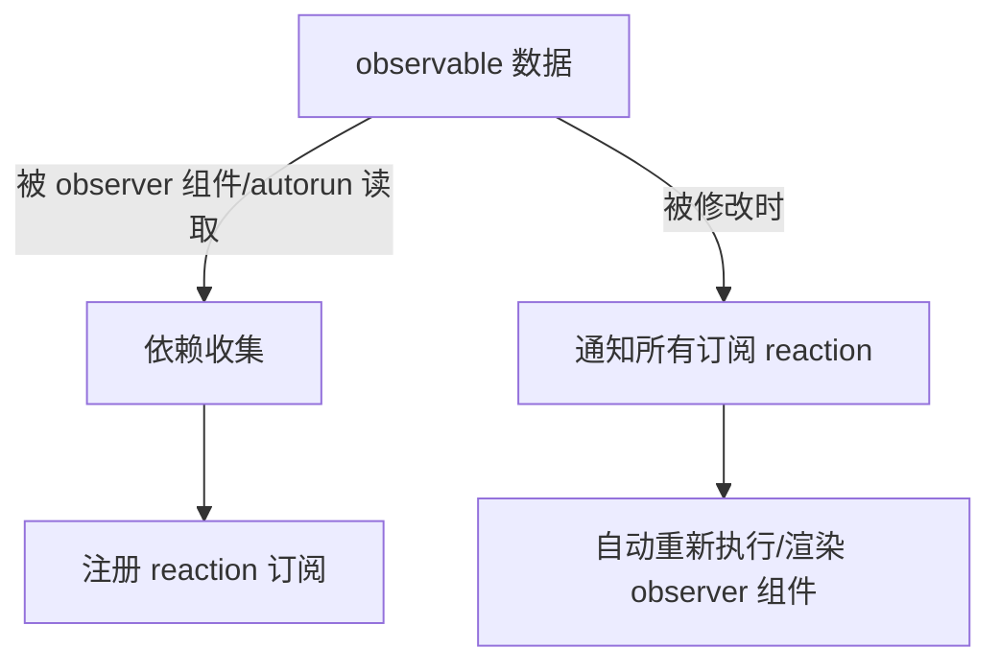

# MobX 简介与实战

## 1. 什么是 MobX？

MobX 是一个基于透明响应式编程（Transparent Functional Reactive Programming, TFRP）思想的状态管理库，最初由 Michel Weststrate 开发，被广泛用于 React 等前端框架中。MobX 通过最小化和自动化状态与视图的同步，让开发者以极简直观的方式管理应用状态，实现"自动追踪依赖、自动更新 UI"。

通俗来说，使用 MobX 管理状态时，你只需专注于“数据如何流动、逻辑怎样变化”，数据变化后，UI 会自动响应更新，无需像 Redux 那样手动 dispatch 或 reducer。

## 2. MobX 的核心概念

- **observable** —— 可观察的数据（state）
- **observer** —— 自动响应数据变化的组件或函数
- **actions** —— 修改 state 的方法（推荐）
- **computed** —— 基于 observable 的派生数据，自动追踪依赖
- **reactions** —— 响应式副作用，自动执行回调

## 3. MobX 的基本使用方法

安装：
```bash
npm install mobx mobx-react-lite
```

一个最简 Demo：

```tsx
import { makeAutoObservable } from "mobx";
import { observer } from "mobx-react-lite";
import React from "react";

// 1. 定义 Store
class CounterStore {
  count = 0;

  constructor() {
    makeAutoObservable(this);
  }

  increment() {
    this.count++;
  }

  decrement() {
    this.count--;
  }
}
const counterStore = new CounterStore();

// 2. 组件中使用
const Counter = observer(() => (
  <div>
    <h1>{counterStore.count}</h1>
    <button onClick={() => counterStore.increment()}>加一</button>
    <button onClick={() => counterStore.decrement()}>减一</button>
  </div>
));

// 3. 挂载
function App() {
  return <Counter />;
}
```

只需用 `makeAutoObservable` 包裹类实例，所有成员属性、方法都会被 MobX 自动“变为可观察/可响应”。用 `observer` 包裹的组件会在数据变化时自动刷新，无需手动调用 `setState` 或类似方法。

## 4. MobX 的优点

1. **超高开发效率**：几乎无需模板代码，极易上手和维护。
2. **极致响应式**：状态变更，视图自动同步，无需考虑 UI 刷新细节。
3. **逻辑高度解耦**：状态（Store）和视图（Component）分离，复用性强。
4. **天生支持面向对象**：class 风格 store 简洁利落，方法/属性自在扩展。
5. **支持异步流畅**：可以直接在 action 内用 async/await 操作异步。
6. **优秀的性能**：自动追踪依赖，细粒度更新，避免无谓的重渲染。

## 5. MobX 的缺点

1. **魔法感强，出错难查**：依赖自动追踪，有时不小心会漏包裹 observable 或 observer，导致 UI 不刷新，别名“MobX 黑魔法”。
2. **调试与全局历史追踪不如 Redux**：对复杂时间旅行、全局状态 Debugger 支持较弱，需要额外工具辅助。
3. **过度响应式可能导致过度渲染**：大粒度 store 或滥用 computed、reaction 可能影响性能。
4. **不适合严格状态不可变场景（如服务端快照、时间旅行）**。
5. **与 React 17 以前的 hook 混用易出陷阱**：需用 mobx-react-lite，且在 hooks 里尽量使用 observable hooks。

## 6. 与其他 React 状态管理库对比

| 特性            | Redux                 | MobX            | Zustand/Recoil/Jotai     |
|-----------------|----------------------|-----------------|--------------------------|
| 哲学            | 单向数据流、纯函数    | 响应式数据流     | 原子化/可组合            |
| 状态定义方式    | Immutable/Reducer     | Observable/Class| Atom/Hook                |
| 视图刷新方式    | 手动 dispatch        | 自动追踪 observer| Hooks/Selector 自动      |
| 模板代码冗余    | 多（样板/Reducer）    | 极少            | 极少                     |
| 异步支持        | 需 thunk/saga         | 原生 async 支持  | 原生 async 支持          |
| Debug 支持      | 完备（Redux DevTools）| 一般             | 一般                     |
| 易用性          | 学习曲线较陡          | 极易上手         | 易上手                   |
| 性能            | 优秀（需优化）        | 优秀（依赖追踪） | 优秀                     |

**简要结论：**
- Redux 适合大型应用，需团队协作、时间旅行、严格可预期等场景。
- MobX 适合数据中台、后台/管理系统、业务驱动型前端，高开发效率，状态同步复杂但可控。
- Zustand/Recoil/Jotai 适合轻量、高并发、Hooks 优先的小项目或独立模块。

## 7. 典型使用场景

- 高度业务复杂、表单多、需要大量状态响应的后台管理系统
- 面向对象逻辑或三方组件库（如 MobxTable、MobxForm 等）
- 需要局部状态且视图与逻辑解耦的模块

## 8. 实现原理揭秘

MobX 之所以被称为“响应式编程黑魔法”，源于它独特的 **自动依赖收集** 和 **最小追踪更新** 机制。下面用简单易懂的方式拆解 MobX 如何实现“状态变了就自动刷新 UI”的过程。

### 8.1 核心三要素

MobX 的响应式系统本质上由三个核心部分组成：

1. **Observable（可观察数据）**  
   使用 `observable` 或 `makeAutoObservable` 修饰的对象/类属性，会被 MobX 变成“可观察”数据，即 MobX 能跟踪它们何时被访问和修改。

2. **Observer（响应式视图）**  
   用 `observer` 包裹的 React 组件，能感知并自动响应它内部读取过的 observable 数据的变更。

3. **Reactions（副作用或响应，Reaction/Autorun/Computed）**  
   任何读取了 observable 的派生逻辑（如 autorun、computed、observer 组件），都被 MobX 自动注册为“订阅者”，当 observable 变化时自动二次执行。

### 8.2 自动依赖收集流程

以 `@observer` 组件为例，MobX 的响应式原理可以分为如下步骤：

1. **渲染追踪**  
   组件初次渲染时，所有被读取的 observable 属性都会被 MobX 记录下来（类似“依赖收集”）。

2. **依赖注册**  
   MobX 维护一张**依赖图（dependency tree）**，知道“哪些 reaction 依赖了哪些 observable”。

3. **变更触发**  
   当 observable 被修改时，MobX 会遍历依赖它的所有 reaction，将它们标记为 dirty，并在合适时机（如下次组件 render）自动刷新。

4. **最小更新**  
   MobX 只会触发和脏 observable 有关的 reaction/组件，其他部分不会无谓更新，实现了细粒度的高性能响应。

### 8.3 内部技术原理

- **ES6 Proxy/defineProperty 劫持**：MobX 利用对象属性拦截技术，实现对数据 get/set 的监听。
- **全局“依赖收集栈”**：渲染/autorun/computed 时，MobX 动态记录“当前正在收集依赖的 reaction”，随后所有 observable 的 get 操作会把自己加入该 reaction 的依赖列表，实现自动追踪。
- **响应分发队列**：通过微任务或同步队列安排 reaction 执行时机，避免重复与性能浪费。
- **脏检查和批量更新**：多次数据变更会合并触发反应，智能去重、合批响应。

### 8.4 经典流程图



### 8.5 源码中的示意（简化版）

```typescript
class ObservableValue<T> {
  value: T
  observers: Set<Reaction> = new Set()

  get() {
    // 如果正在依赖收集，把当前 reaction 加入自己依赖列表
    const currentReaction = getCurrentCollectingReaction()
    if (currentReaction) {
      this.observers.add(currentReaction)
      currentReaction.registerDependency(this)
    }
    return this.value
  }
  set(newValue: T) {
    if (this.value !== newValue) {
      this.value = newValue
      // 通知所有依赖此值的 reaction
      this.observers.forEach(reaction => reaction.schedule())
    }
  }
}
```

### 8.6 总结

MobX 的“自动响应式”不是靠手动声明依赖，也不依赖冗余的 reducer、dispatch。它通过 Proxy/Get/Set 劫持和依赖树注册，将 UI 组件、computed、autorun 等 pull-API 转化为 push-API，极大减少了模板和样板代码，带来天然的高效同步机制。

**一句话理解：**  
MobX 让你的函数“记得”用到了哪些数据，数据一变立刻反应，无需关心底层数据流分发，“响应一切可见”。


