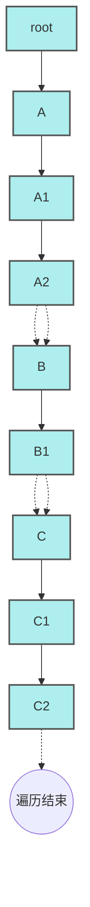

# 理解 Fiber 遍历算法 —— 用代码和图示讲清「深度优先遍历」

在 React 的 Fiber 架构中，更新和调度的本质就是遍历链状结构「Fiber 树」。下面通过一个简化 TypeScript 例子，梳理 Fiber 遍历的过程与背后的逻辑。

---

## Fiber 节点的数据结构

每个 Fiber 节点除了「类型」外，用 `child`、`sibling`、`parent` 指针构建了一个多叉树：

```typescript
class Fiber {
    type: string
    child: Fiber | null
    sibling: Fiber | null
    parent: Fiber | null
    constructor(type: string) {
        this.type = type
        this.child = null
        this.sibling = null
        this.parent = null
    }
}
```

- `child` 指向第一个子节点
- `sibling` 指向右边的兄弟节点
- `parent` 指向父节点

通过这三根指针组成了一颗可以自底向上（parent）、自右向左（sibling）、自上向下（child）遍历的数据结构。

---

## 关键：performUnitOfWork 的遍历实现

核心函数 `performUnitOfWork` 做了两件事：

1. **执行当前节点的工作**（示例中用 `console.log`）
2. **决定下一个要遍历的 Fiber 节点** —— 按照“先子节点后兄弟节点，否则回溯父节点”的顺序

代码如下：

```typescript
const performUnitOfWork = (fiber: Fiber) => {
    console.log(fiber.type) // 模拟执行Fiber工作
    if (fiber.child) {
        return fiber.child      // 优先遍历子节点
    }

    // 没有child，就找下一个sibling，没有sibling向上回溯parent
    let next: Fiber | null = fiber
    while (next) {
        if (next.sibling) {
            return next.sibling
        }
        next = next.parent
    }
    // 如果没有父级也没有兄弟，说明遍历完毕，返回undefined
}
```

实际上这是一个典型「深度优先遍历」（DFS, Depth-First Search）：

1. 优先访问 child
2. child 为空则访问下一个 sibling
3. sibling 也为空则不断回溯 parent，直到找到上级的 sibling
4. parent 也没有 sibling，遍历结束

这种遍历方式可以保证**逐步深入 Fiber 树**，且每个节点都只访问一遍。

---

## 优化版 Fiber 树结构与遍历顺序演示

为了更好地说明深度优先遍历过程，我们设计如下更具代表性的 Fiber 树结构，包含了父-子、兄弟多层关系：

```typescript
let root = new Fiber("root")
let A = new Fiber("A")
let B = new Fiber("B")
let C = new Fiber("C")
let A1 = new Fiber("A1")
let A2 = new Fiber("A2")
let B1 = new Fiber("B1")
let C1 = new Fiber("C1")
let C2 = new Fiber("C2")

root.child = A
A.parent = root
A.sibling = B
B.parent = root
B.sibling = C
C.parent = root

A.child = A1
A1.parent = A
A1.sibling = A2
A2.parent = A

B.child = B1
B1.parent = B

C.child = C1
C1.parent = C
C1.sibling = C2
C2.parent = C
```

对应的树状结构如下（缩进代表层级关系）：

```
root
 ├─ A
 │   ├─ A1
 │   └─ A2
 ├─ B
 │   └─ B1
 └─ C
     ├─ C1
     └─ C2
```

- `child` 指向第一个子节点
- 通过 `sibling` 串起同级兄弟

---

### 遍历过程示意流程（mermaid 图）

深度优先遍历过程中，每次优先 child，然后是 sibling，最后回溯 parent 的 sibling，直到结束。用如下流程图可视化遍历顺序：



该遍历顺序为：`root → A → A1 → A2 → B → B1 → C → C1 → C2`

---

## 遍历入口

Traversal 的入口代码与之前一致：

```typescript
let current: Fiber | undefined = root
while (current) {
    current = performUnitOfWork(current)
}
```

- 每次调用 `performUnitOfWork`，返回下一个待遍历节点
- 返回 undefined 时跳出循环，遍历结束

---

## 总结

通过这种「优先 child、再寻找 sibling、最后回溯 parent」的深度优先遍历，Fiber 树能够在可中断（分片）的情况下高效、稳定地调度更新。这也是 React Fiber 架构用以实现异步可中断渲染的底层基础。

