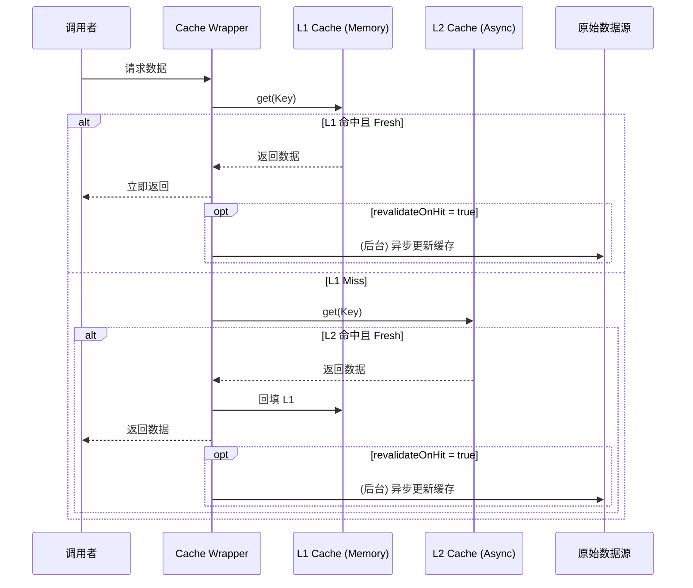
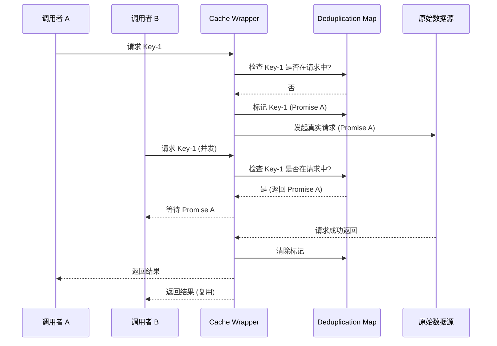
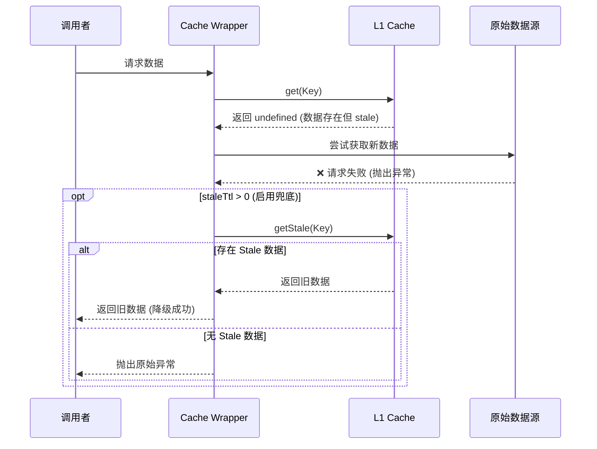
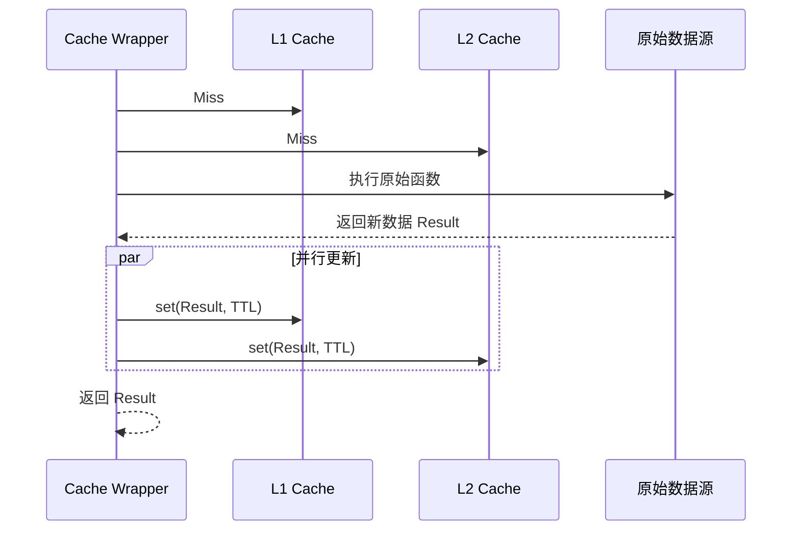

# @smileznpm/node-req-cache

一个用于 Node.js 的高性能异步请求缓存包装器。它提供了多级缓存（内存 L1 + 异步 L2）、请求合并（Deduplication）以及灵活的过期与兜底策略，旨在提升高并发场景下的系统性能和稳定性。

## ✨ 特性

- **多级缓存架构**：
  - **L1 缓存**：基于内存的同步 LRU 缓存，读取速度极快。
  - **L2 缓存**：模拟异步存储接口（设计上支持扩展对接 Redis 等外部存储），提供持久化能力。
- **请求合并 (Request Deduplication)**：防止高并发下对同一资源的重复请求（缓存击穿保护），同一时刻相同的请求只会执行一次。
- **Stale-While-Revalidate**：支持后台静默刷新缓存，在保证响应速度的同时保持数据新鲜。
- **故障兜底 (Stale Fallback)**：当上游服务请求失败时，可自动降级返回旧的缓存数据，提高系统可用性。
- **弹性重试**：支持请求失败自动重试。
- **TypeScript 支持**：完全使用 TypeScript 编写，提供完整的类型定义。

## 📦 安装

```bash
npm install @smileznpm/node-req-cache
# 或者
pnpm add @smileznpm/node-req-cache
```

## 🚀 使用方法

### 基础用法

将任意返回 Promise 的函数包装起来，即可自动获得缓存能力：

```typescript
import { nodeReqCache } from '@smileznpm/node-req-cache';

// 模拟一个耗时的异步请求
async function fetchUserInfo(userId: string) {
  console.log(`Fetching data for ${userId}...`);
  await new Promise(resolve => setTimeout(resolve, 1000));
  return { id: userId, name: 'Alice', timestamp: Date.now() };
}

// 创建带缓存的版本
const getCachedUserInfo = nodeReqCache(fetchUserInfo, {
  ttl: 5000, // 缓存 5 秒
});

// 调用
async function run() {
  // 第一次调用：执行真实请求
  const data1 = await getCachedUserInfo('123'); 
  
  // 第二次调用：命中 L1 内存缓存，立即返回
  const data2 = await getCachedUserInfo('123');
}
```

### 高级配置

```typescript
const getProductDetail = nodeReqCache(fetchProductFromDb, {
  // 自定义 Key 生成逻辑
  keyGenerator: (id, region) => `product:${id}:${region}`,
  
  // L1 内存缓存最大容量
  l1CacheSize: 500,
  
  // 数据新鲜时间 (1分钟)
  ttl: 60 * 1000,
  
  // 故障兜底时间 (5分钟)
  // 如果 ttl 过期，但请求数据库失败，在 5 分钟内允许返回旧数据
  staleTtl: 5 * 60 * 1000,
  
  // 命中缓存后是否后台刷新
  revalidateOnHit: true,
  
  // 请求失败重试次数
  retry: 3
});
```

## ⚙️ 配置项 (Options)

| 参数名 | 类型 | 默认值 | 说明 |
|---|---|---|---|
| `ttl` | `number` | `60000` | 缓存新鲜时间 (ms)。在此时间内访问直接返回缓存。 |
| `staleTtl` | `number` | `0` | 额外允许的过期时间 (ms)。在 `ttl` 过期后，如果请求失败，允许返回旧数据直到 `ttl + staleTtl`。 |
| `l1CacheSize` | `number` | `100` | L1 内存缓存的最大条目数 (LRU 策略)。 |
| `l2CacheSize` | `number` | `1000` | L2 异步缓存的最大条目数 (LRU 策略)。 |
| `keyGenerator` | `Function` | `JSON.stringify` | 自定义缓存 Key 生成函数。默认根据参数序列化生成。 |
| `revalidateOnHit` | `boolean` | `false` | 是否开启 Stale-While-Revalidate 变体。为 `true` 时，即使命中缓存也会在后台发起一次更新请求。 |
| `retry` | `number` | `0` | 源函数执行失败时的重试次数。 |

## 🛠 执行流程与核心代码

`node-req-cache` 针对不同场景有不同的执行路径。以下结合代码片段说明核心实现原理。

### 核心包装逻辑

采用高阶函数模式，拦截原始调用：

```typescript
export function nodeReqCache(fn, options) {
  // 初始化 L1, L2 缓存和请求合并 Map
  const l1Cache = new MemoryLRUCache(...);
  const ongoingRequests = new Map();

  return async (...args) => {
    const key = keyGenerator(...args);
    
    // 1. L1 快速检查 (内存)
    const l1Result = l1Cache.get(key);
    if (l1Result !== undefined) return l1Result;

    // 2. 请求合并 (Deduplication)
    // 如果已有相同 Key 的请求正在进行，直接复用 Promise，防止缓存击穿
    if (ongoingRequests.has(key)) {
      return ongoingRequests.get(key);
    }

    // 3. 启动新任务
    const promise = (async () => {
      // ... 检查 L2，执行 fn，写入缓存 ...
    })();
    
    ongoingRequests.set(key, promise);
    return promise;
  };
}
```

### 场景 1: 缓存命中 (Cache Hit)

当数据存在于 L1 (内存) 或 L2 (异步) 缓存中且未过期时。



### 场景 2: 缓存未命中 & 请求合并 (Miss & Deduplication)

当缓存不存在，且可能有多个并发请求同时发起时，`ongoingRequests` Map 发挥作用：



### 场景 3: 故障兜底 (Stale Fallback)

当缓存过期 (TTL)，但尝试获取新数据失败时，降级使用旧数据。

代码实现片段：
```typescript
try {
  return await fetchAndUpdate(); // 尝试获取新数据
} catch (error) {
  // 请求失败，检查是否有兜底数据
  if (staleTtl > 0) {
    const staleL1 = l1Cache.getStale(key); // 获取过期但未删除的数据
    if (staleL1 !== undefined) return staleL1;
  }
  throw error; // 无兜底，抛出异常
}
```



### 场景 4: 完整穿透流程 (Cache Miss & Update)

最完整的冷启动流程。



### 核心类说明

*   **MemoryLRUCache (L1)**: 使用 `Map` 保持插入顺序来实现 LRU 淘汰策略。读取操作 O(1)，无锁，极快。
*   **AsyncLRUCache (L2)**: 模拟异步 IO 的缓存层。设计用于将来扩展对接 Redis 或文件系统。

---

**License**: MIT
